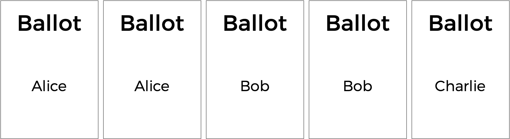
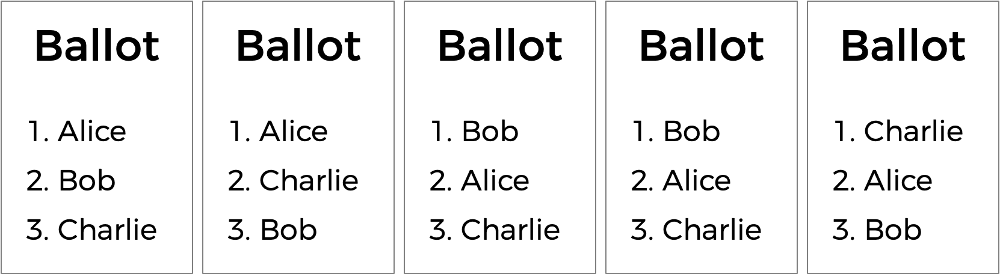
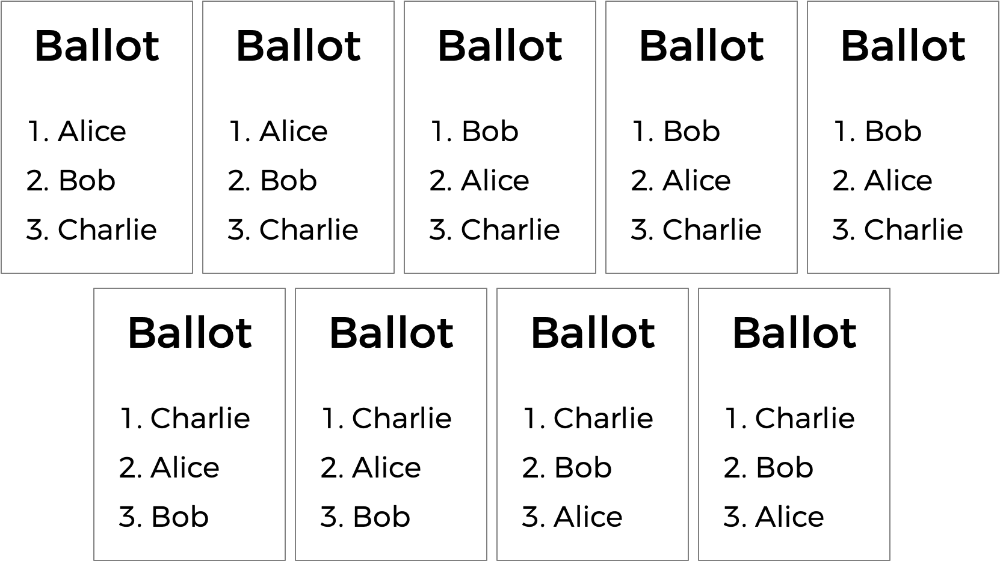

# Problem set 3

## Plurality

Problem to Solve

Elections come in all shapes and sizes. In the UK, the Prime Minister is officially appointed by the monarch, who generally chooses the leader of the political party that wins the most seats in the House of Commons. The United States uses a multi-step Electoral College process where citizens vote on how each state should allocate Electors who then elect the President.

Perhaps the simplest way to hold an election, though, is via a method commonly known as the “plurality vote” (also known as “first-past-the-post” or “winner take all”). In the plurality vote, every voter gets to vote for one candidate. At the end of the election, whichever candidate has the greatest number of votes is declared the winner of the election.

### Distribution Code

For this problem, you’ll extend the functionality of “distribution code” provided to you by CS50’s staff.

Download the distribution code:

Log into cs50.dev, click on your terminal window, and execute cd by itself. You should find that your terminal window’s prompt resembles the below:

```
$
```

Next execute

```
wget https://cdn.cs50.net/2026/x/psets/3/plurality.zip
```

in order to download a ZIP called plurality.zip into your codespace.

Then execute

```
unzip plurality.zip
```

to create a folder called plurality. You no longer need the ZIP file, so you can execute

```
rm plurality.zip
```

and respond with “y” followed by Enter at the prompt to remove the ZIP file you downloaded.

Now type

```
cd plurality
```

followed by Enter to move yourself into (i.e., open) that directory. Your prompt should now resemble the below.

```
plurality/ $
```

If all was successful, you should execute

```
ls
```

and see a file named plurality.c. Executing code plurality.c should open the file where you will type your code for this problem set. If not, retrace your steps and see if you can determine where you went wrong!

### Understand the code in plurality.c

Whenever you’ll extend the functionality of existing code, it’s best to be sure you first understand it in its present state.

Look first at the top of the file. The line #define MAX 9 is some syntax used here to mean that MAX is a constant (equal to 9) that can be used throughout the program. Here, it represents the maximum number of candidates an election can have.


```
// Max number of candidates
#define MAX 9
```

Notice that plurality.c then uses this constant to define a global array—that is, an array that any function can access.

```
// Array of candidates
candidate candidates[MAX];
```

But what, in this case, is a candidate? In plurality.c, a candidate is a struct. Each candidate has two fields: a string called name representing the candidate’s name, and an int called votes representing the number of votes the candidate has.

```
// Candidates have name and vote count
typedef struct
{
    string name;
    int votes;
}
candidate;
```

Now, take a look at the main function itself. See if you can find where the program sets a global variable candidate_count representing the number of candidates in the election.

```
// Number of candidates
int candidate_count;
```

What about where it copies command-line arguments into the array candidates?

```
// Populate array of candidates
candidate_count = argc - 1;
if (candidate_count > MAX)
{
    printf("Maximum number of candidates is %i\n", MAX);
    return 2;
}
for (int i = 0; i < candidate_count; i++)
{
    candidates[i].name = argv[i + 1];
    candidates[i].votes = 0;
}
```

And where it asks the user to type in the number of voters?

```
int voter_count = get_int("Number of voters: ");
```

Then, the program lets every voter type in a vote, calling the vote function on each candidate voted for. Finally, main makes a call to the print_winner function to print out the winner (or winners) of the election. We’ll leave it to you to identify the code that implements this functionality.

If you look further down in the file, though, you’ll notice that the vote and print_winner functions have been left blank.

```
// Update vote totals given a new vote
bool vote(string name)
{
    // TODO
    return false;
}

// Print the winner (or winners) of the election
void print_winner(void)
{
    // TODO
    return;
}
```

This part is up to you to complete! You should not modify anything else in plurality.c other than the implementations of the vote and print_winner functions (and the inclusion of additional header files, if you’d like).

---

## Runoff
### Problem to Solve

You already know about plurality elections, which follow a very simple algorithm for determining the winner of an election: every voter gets one vote, and the candidate with the most votes wins.

But the plurality vote does have some disadvantages. What happens, for instance, in an election with three candidates, and the ballots below are cast?



A plurality vote would here declare a tie between Alice and Bob, since each has two votes. But is that the right outcome?

There’s another kind of voting system known as a ranked-choice voting system. In a ranked-choice system, voters can vote for more than one candidate. Instead of just voting for their top choice, they can rank the candidates in order of preference. The resulting ballots might therefore look like the below.



Here, each voter, in addition to specifying their first preference candidate, has also indicated their second and third choices. And now, what was previously a tied election could now have a winner. The race was originally tied between Alice and Bob, so Charlie was out of the running. But the voter who chose Charlie preferred Alice over Bob, so Alice could here be declared the winner.

Ranked choice voting can also solve yet another potential drawback of plurality voting. Take a look at the following ballots.



Who should win this election? In a plurality vote where each voter chooses their first preference only, Charlie wins this election with four votes compared to only three for Bob and two for Alice. But a majority of the voters (5 out of the 9) would be happier with either Alice or Bob instead of Charlie. By considering ranked preferences, a voting system may be able to choose a winner that better reflects the preferences of the voters.

One such ranked choice voting system is the instant runoff system. In an instant runoff election, voters can rank as many candidates as they wish. If any candidate has a majority (more than 50%) of the first preference votes, that candidate is declared the winner of the election.

If no candidate has more than 50% of the vote, then an “instant runoff” occurrs. The candidate who received the fewest number of votes is eliminated from the election, and anyone who originally chose that candidate as their first preference now has their second preference considered. Why do it this way? Effectively, this simulates what would have happened if the least popular candidate had not been in the election to begin with.

The process repeats: if no candidate has a majority of the votes, the last place candidate is eliminated, and anyone who voted for them will instead vote for their next preference (who hasn’t themselves already been eliminated). Once a candidate has a majority, that candidate is declared the winner.

Sounds a bit more complicated than a plurality vote, doesn’t it? But it arguably has the benefit of being an election system where the winner of the election more accurately represents the preferences of the voters. In a file called runoff.c in a folder called runoff, create a program to simulate a runoff election.
